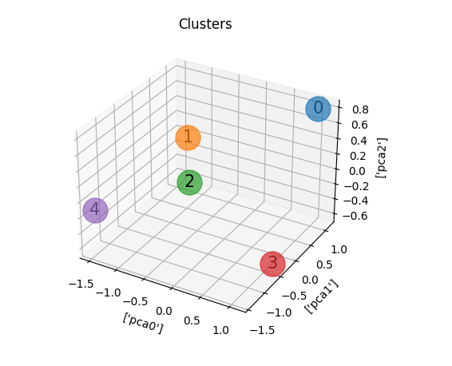
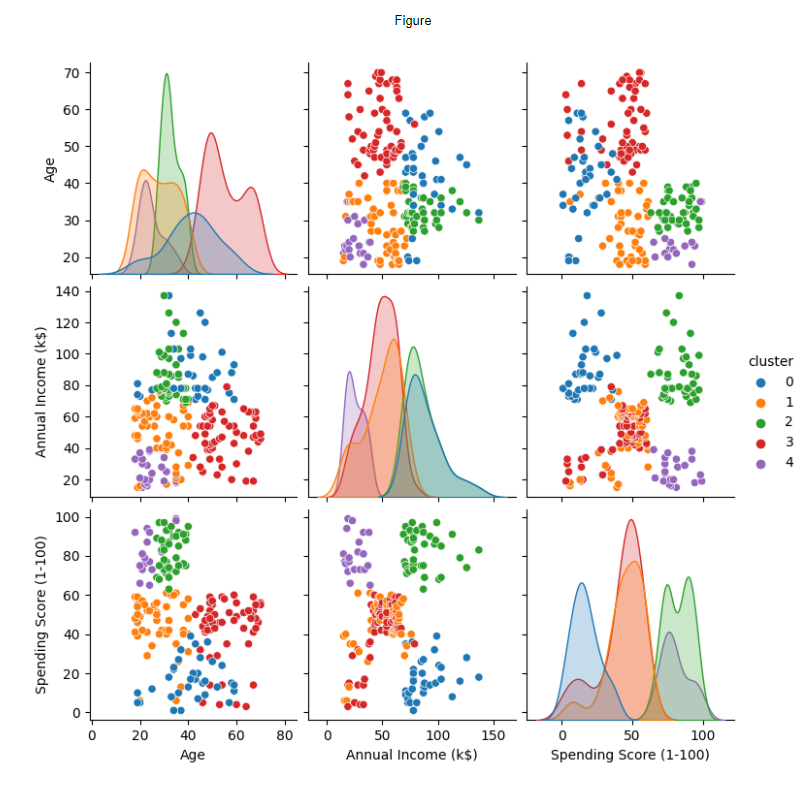
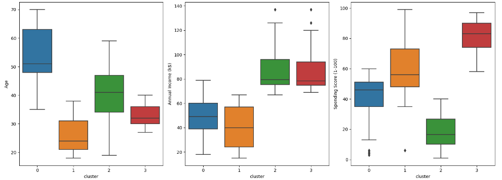

# Customer-Segmentation-Supermarket
This repository was made to explain the project of **[Kaggle](https://www.kaggle.com/datasets/vjchoudhary7/customer-segmentation-tutorial-in-python/data)**:

**The comments in the codes are in PT-BR**.
## Objectives:
- Study of customer segmentation for a supermarket for a better understanding of customers.
 

## Main libraries used:
- Pandas, Matplotlib, Sklearn and Seaborn.
## Original dataset of the project
- [Mall_Customers.csv](https://github.com/BrunoFelipeCB/Customer-Segmentation-Supermarket/blob/main/Mall_Customers.csv)
## You can find me at:
&nbsp;&nbsp;
## [Step 1: Data Segmentation Project](https://github.com/BrunoFelipeCB/Customer-Segmentation-Supermarket/blob/main/1.Data%20Segmentation%20Project.ipynb)
- In the first notebook, I imported the original dataset and performed checks to assess the data integrity.
- I imported the [ydata_profiling](https://github.com/ydataai/ydata-profiling) library to assist me in conducting analyses, generating a [report](https://github.com/BrunoFelipeCB/Customer-Segmentation-Supermarket/blob/main/eda_supermarket.html).
- I deleted the 'CustomerID' column as it would not help us in customer segmentation.
- We generated 2 graphs for comparison with the report, and then exported the dataset named 'Mall_Customers_no_CustomerID.csv'.
## [Step 2: Analysis without preprocessing](https://github.com/BrunoFelipeCB/Customer-Segmentation-Supermarket/blob/main/2.%20Analysis_without_preprocessing.ipynb)
- In the second notebook, I imported the 'Mall_Customers_no_CustomerID.csv' dataset, and initially, I will analyze the dataset without preprocessing. I am doing this solely for personal comparisons with the report and future function references.
- Using the **elbow method**, we determined that a suitable number of clusters for this scenario would be 6.
- Using 6 clusters and saving the data with the help of Joblib, we continued our analysis and generated the pairplot again.
- With the assistance of the boxplot, I managed to segment the clusters based on their Age, Annual Income (k$), and Spending Score (1-100), achieving an initial clustering.
- I generated the same boxplot, but this time differentiated by gender to check if there are significant differences between genders.
- I created a function called 'visualizar_cluster' and generated a 3D plot with points and centroids.
- Finally, the "visualizar_cluster()" function and the Elbow and Silhouette plots will be exported to a '.py' file for easier reference when used later.
## [Step 3: Pipeline](https://github.com/BrunoFelipeCB/Customer-Segmentation-Supermarket/blob/main/3.Pipeline.ipynb)
- In the third notebook, I imported the 'Mall_Customers_no_CustomerID.csv' dataset again and **will preprocess the dataset.**
- After the preprocessing is done, importing the  [Funcoes_auxiliares](https://github.com/BrunoFelipeCB/Customer-Segmentation-Supermarket/blob/main/Funcoes_auxiliares.py) file brought in 'graficos_elbow_silhouette' to use the elbow method again, and this time, I believe it's better to use 'n_clusters=4'.
- Using the Pipeline process and again saving the data with Joblib, we found some different clusters.
- Again, with the help of the boxplot, we managed to categorize the clusters.
## [Step 4: Pipeline PCA.](https://github.com/BrunoFelipeCB/Customer-Segmentation-Supermarket/blob/main/4.Pipeline_PCA.ipynb)
- In the fourth notebook, I imported the 'Mall_Customers_no_CustomerID.csv' dataset again and will preprocess the dataset, this time using PCA.
- Following the same step-by-step process from  [Step 3](https://github.com/BrunoFelipeCB/Customer-Segmentation-Supermarket/blob/main/3.Pipeline.ipynb) , we managed to generate a 3D plot using the relevant columns to be addressed, and we successfully separated the central clusters in the best possible way.

## Step 5: Considerations and results.

- With the pipeline performing preprocessing, PCA, and K-Means, the dataset was segmented into 4 clusters, as shown in the figures below:

- Cluster 0 consists of older individuals with intermediate salaries and scores.
- Cluster 1 consists of younger individuals with intermediate salaries and higher scores.
- Cluster 2 consists of wealthier individuals with lower scores.
- Cluster 3 consists of middle-aged individuals with high salaries and high scores.

#### Translating the points above into a table:

| Spending Score (1-100) | Annual Income (k$)    | Age      | Cluster |
| -----------------------| --------------------- | -------- | ------- |
| High                   | High                  | Moderate | 0       |
| High                   | Moderate              | Young    | 1       |
| Low                    | High                  | Moderate | 2       |
| High                   | High                  | Moderate | 3       |

